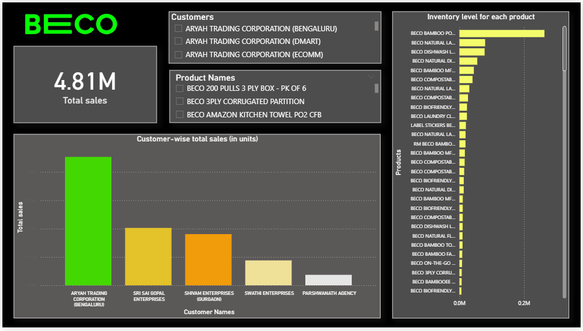

# BECO Sales & Inventory Dashboard – Power BI

This project showcases a Power BI dashboard built for **BECO**, designed to analyze **unit-level sales**, **customer-wise returns**, and **inventory levels** across products.

---

## Files Used

- `Sales Dump.xlsx` 
- `Customer Master.xlsx` 
- `Inventory Warehouse Report_15-07-2025.xlsx` 
- `Pack of Conversion.xlsx` 

---

## Data Cleaning (Power Query)

- Filtered only "Customer" entries from master data
- Capitalized inconsistent text (e.g., `KARNATAKA` → `Karnataka`)
- Rounded numerical fields to 2 decimal places
- Created `ExactQuantity` to convert negative return quantities to positive

  This was done for all Excel files
---

## Data Modeling

- Created relationships:
The model below illustrates how tables are connected in Power BI.


- All relationships are **Many-to-One** 
 


## DAX Measures

```DAX
Total sales = 
VAR totalUnits = 
    SUMX(
        'Sales Dump Sheet',
        [ExactQuantity] * RELATED('Pack of Conversion'[Units])
    )
RETURN
    IF(
        ISBLANK(totalUnits), 
        0, 
        totalUnits
    )
```
## The Dashboard
 

